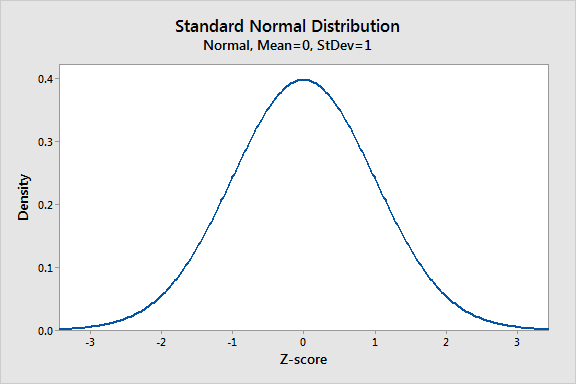
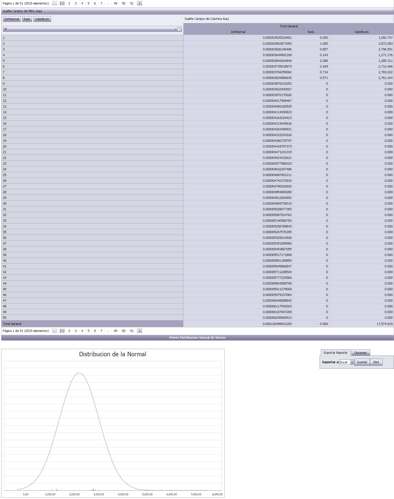
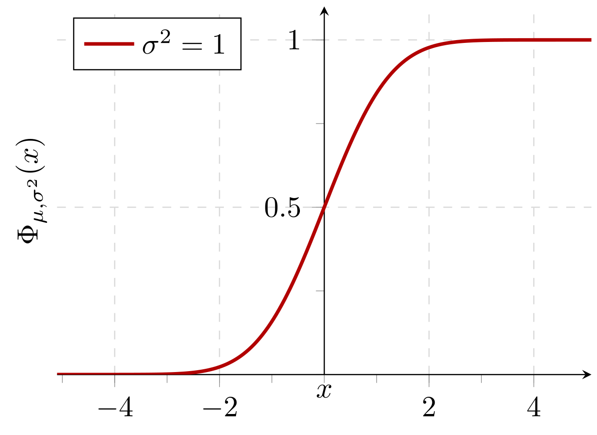
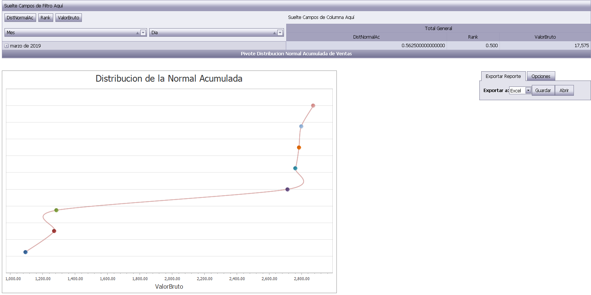

# Demo Requeriments

- Microsoft Sql server 2017 (localdb for demo, any for advanced users)
- .Net Framework 4.7.2
- Internet Information Server IIS 

# Sql-Server-Normal-Distribution-Gauss-Bell-Curve

Sql Server Normal Distribution, Gauss or Bell Curve

The normal distribution is the most important probability distribution in statistics because it fits many natural phenomena. For example, heights, blood pressure, measurement error, and IQ scores follow the normal distribution. It is also known as the Gaussian distribution and the bell curve.

The normal distribution is a probability function that describes how the values of a variable are distributed. It is a symmetric distribution where most of the observations cluster around the central peak and the probabilities for values further away from the mean taper off equally in both directions. Extreme values in both tails of the distribution are similarly unlikely.

In this blog post, you’ll learn how to use the normal distribution, its parameters, and how to calculate Z-scores to standardize your data and find probabilities.
Example of Normally Distributed Data: Heights

Height data are normally distributed. The distribution in this example fits real data that I collected from 14-year-old girls during a study.

Normal distribution of heights.

As you can see, the distribution of heights follows the typical pattern for all normal distributions. Most girls are close to the average (1.512 meters). Small differences between an individual’s height and the mean occur more frequently than substantial deviations from the mean. The standard deviation is 0.0741m, which indicates the typical distance that individual girls tend to fall from mean height.

The distribution is symmetric. The number of girls shorter than average equals the number of girls taller than average. In both tails of the distribution, extremely short girls occur as infrequently as extremely tall girls.
Parameters of the Normal Distribution

As with any probability distribution, the parameters for the normal distribution define its shape and probabilities entirely. The normal distribution has two parameters, the mean and standard deviation. The normal distribution does not have just one form. Instead, the shape changes based on the parameter values, as shown in the graphs below.
Mean

The mean is the central tendency of the distribution. It defines the location of the peak for normal distributions. Most values cluster around the mean. On a graph, changing the mean shifts the entire curve left or right on the X-axis.

Graph that display normal distributions with different means.
Standard deviation

The standard deviation is a measure of variability. It defines the width of the normal distribution. The standard deviation determines how far away from the mean the values tend to fall. It represents the typical distance between the observations and the average.

On a graph, changing the standard deviation either tightens or spreads out the width of the distribution along the X-axis. Larger standard deviations produce distributions that are more spread out.

Graph that displays normal distributions with different standard deviations.

When you have narrow distributions, the probabilities are higher that values won’t fall far from the mean. As you increase the spread of the distribution, the likelihood that observations will be further away from the mean also increases.
Population parameters versus sample estimates

The mean and standard deviation are parameter values that apply to entire populations. For the normal distribution, statisticians signify the parameters by using the Greek symbol μ (mu) for the population mean and σ (sigma) for the population standard deviation.

Unfortunately, population parameters are usually unknown because it’s generally impossible to measure an entire population. However, you can use random samples to calculate estimates of these parameters. Statisticians represent sample estimates of these parameters using x̅ for the sample mean and s for the sample standard deviation.

Related posts: Measures of Central Tendency and Measures of Variability
Common Properties for All Forms of the Normal Distribution

Despite the different shapes, all forms of the normal distribution have the following characteristic properties.

    They’re all symmetric. The normal distribution cannot model skewed distributions.
    The mean, median, and mode are all equal.
    Half of the population is less than the mean and half is greater than the mean.
    The Empirical Rule allows you to determine the proportion of values that fall within certain distances from the mean. More on this below!

While the normal distribution is essential in statistics, it is just one of many probability distributions, and it does not fit all populations. To learn how to determine whether the normal distribution provides the best fit to your sample data, read my posts about How to Identify the Distribution of Your Data and Assessing Normality: Histograms vs. Normal Probability Plots.
The Empirical Rule for the Normal Distribution

When you have normally distributed data, the standard deviation becomes particularly valuable. You can use it to determine the proportion of the values that fall within a specified number of standard deviations from the mean. For example, in a normal distribution, 68% of the observations fall within +/- 1 standard deviation from the mean. This property is part of the Empirical Rule, which describes the percentage of the data that fall within specific numbers of standard deviations from the mean for bell-shaped curves.
Mean +/- standard deviations	Percentage of data contained
1	68%
2	95%
3	99.7%

Let’s look at a pizza delivery example. Assume that a pizza restaurant has a mean delivery time of 30 minutes and a standard deviation of 5 minutes. Using the Empirical Rule, we can determine that 68% of the delivery times are between 25-35 minutes (30 +/- 5), 95% are between 20-40 minutes (30 +/- 2*5), and 99.7% are between 15-45 minutes (30 +/-3*5). The chart below illustrates this property graphically.

Graph that displays a normal distribution with areas divided by standard deviations.
Standard Normal Distribution and Standard Scores

As we’ve seen above, the normal distribution has many different shapes depending on the parameter values. However, the standard normal distribution is a special case of the normal distribution where the mean is zero and the standard deviation is 1. This distribution is also known as the Z-distribution.

A value on the standard normal distribution is known as a standard score or a Z-score. A standard score represents the number of standard deviations above or below the mean that a specific observation falls. For example, a standard score of 1.5 indicates that the observation is 1.5 standard deviations above the mean. On the other hand, a negative score represents a value below the average. The mean has a Z-score of 0.

Graph that display a standard normal distribution.

Suppose you weigh an apple and it weighs 110 grams. There’s no way to tell from the weight alone how this apple compares to other apples. However, as you’ll see, after you calculate its Z-score, you know where it falls relative to other apples.
Standardization: How to Calculate Z-scores

Standard scores are a great way to understand where a specific observation falls relative to the entire distribution. They also allow you to take observations drawn from normally distributed populations that have different means and standard deviations and place them on a standard scale. This standard scale enables you to compare observations that would otherwise be difficult.

This process is called standardization, and it allows you to compare observations and calculate probabilities across different populations. In other words, it permits you to compare apples to oranges. Isn’t statistics great!

To standardize your data, you need to convert the raw measurements into Z-scores.

To calculate the standard score for an observation, take the raw measurement, subtract the mean, and divide by the standard deviation. Mathematically, the formula for that process is the following:

Z = {\displaystyle \frac {\text {X} - \mu}{\sigma}}

X represents the raw value of the measurement of interest. Mu and sigma represent the parameters for the population from which the observation was drawn.

After you standardize your data, you can place them within the standard normal distribution. In this manner, standardization allows you to compare different types of observations based on where each observation falls within its own distribution.
Example of Using Standard Scores to Make an Apples to Oranges Comparison

Suppose we literally want to compare apples to oranges. Specifically, let’s compare their weights. Imagine that we have an apple that weighs 110 grams and an orange that weighs 100 grams.

If we compare the raw values, it’s easy to see that the apple weighs more than the orange. However, let’s compare their standard scores. To do this, we’ll need to know the properties of the weight distributions for apples and oranges. Assume that the weights of apples and oranges follow a normal distribution with the following parameter values:
	Apples	Oranges
Mean weight grams	100	140
Standard Deviation	15	25

Now we’ll calculate the Z-scores:

    Apple = 110-100/15 = 0.667
    Orange = 100-140/25 = -1.6

The Z-score for the apple (0.667) is positive, which means that our apple weighs more than the average apple. It’s not an extreme value by any means, but it is above average for apples. On the other hand, the orange has fairly negative Z-score (-1.6). It’s pretty far below the mean weight for oranges. I’ve placed these Z-values in the standard normal distribution below.

Graph of a standard normal distribution that compares apples to oranges using a Z-score.

While our apple weighs more than our orange, we are comparing a somewhat heavier than average apple to a downright puny orange! Using Z-scores, we’ve learned how each fruit fits within its own distribution and how they compare to each other.
Finding Areas Under the Curve of a Normal Distribution

The normal distribution is a probability distribution. As with any probability distribution, the proportion of the area that falls under the curve between two points on a probability distribution plot indicates the probability that a value will fall within that interval. To learn more about this property, read my post about Understanding Probability Distributions.

Typically, I use statistical software to find areas under the curve. However, when you’re working with the normal distribution and convert values to standard scores, you can calculate areas by looking up Z-scores in a Standard Normal Distribution Table.

Because there are an infinite number of different normal distributions, publishers can’t print a table for each distribution. However, you can transform the values from any normal distribution into Z-scores, and then use a table of standard scores to calculate probabilities.
Using a Table of Z-scores

Let’s take the Z-score for our apple (0.667) and use it to determine its weight percentile. A percentile is the proportion of a population that falls below a specific value. Consequently, to determine the percentile, we need to find the area that corresponds to the range of Z-scores that are less than 0.667. In the portion of the table below, the closest Z-score to ours is 0.65, which we’ll use.

Photograph shows a portion of a table of standard scores (Z-scores).

The trick with these tables is to use the values in conjunction with the properties of the normal distribution to calculate the probability that you need. The table value indicates that the area of the curve between -0.65 and +0.65 is 48.43%. However, that’s not what we want to know. We want the area that is less than a Z-score of 0.65.

We know that the two halves of the normal distribution are mirror images of each other. So, if the area for the interval from -0.65 and +0.65 is 48.43%, then the range from 0 to +0.65 must be half of that: 48.43/2 = 24.215%. Additionally, we know that the area for all scores less than zero is half (50%) of the distribution.

Therefore, the area for all scores up to 0.65 = 50% + 24.215% = 74.215%

Our apple is at approximately the 74th percentile.

Below is a probability distribution plot produced by statistical software that shows the same percentile along with a graphical representation of the corresponding area under the curve. The value is slightly different because we used a Z-score of 0.65 from the table while the software uses the more precise value of 0.667.

A probability distribution plot that graphically displays a percentile using a Z-score.
Other Reasons Why the Normal Distribution is Important

In addition to all of the above, there are several other reasons why the normal distribution is crucial in statistics.

    Some statistical hypothesis tests assume that the data follow a normal distribution. However, as I explain in my post about parametric and nonparametric tests, there’s more to it than only whether the data are normally distributed.
    Linear and nonlinear regression both assume that the residuals follow a normal distribution. Learn more in my post about assessing residual plots.
    The central limit theorem states that as the sample size increases, the sampling distribution of the mean follows a normal distribution even when the underlying distribution of the original variable is non-normal.

That was quite a bit about the normal distribution! Hopefully, you can understand that it is crucial because of the many ways that analysts use it.

Source: https://statisticsbyjim.com/basics/normal-distribution/

# Cumulative Normal Distribution

Cumulative probability of a normal distribution with expected value 0 and standard deviation 1:

## License

This is free and unencumbered software released into the public domain  - see the [LICENSE](/LICENSE) file for details.

Made with ❤️ by [Javier Cañon](https://www.javiercanon.com).